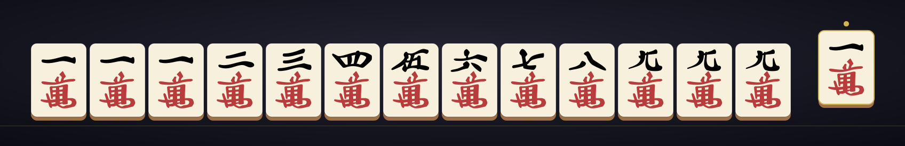
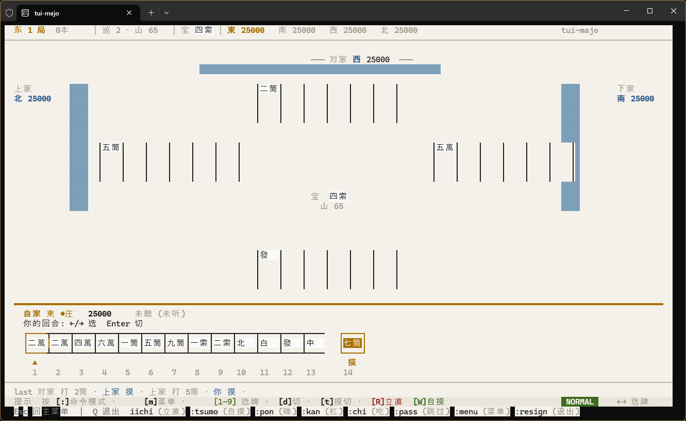

# kagetsu

[](LICENSE)

<p align="center">
  
</p>

> Built for slacking off at work.

**kagetsu** is a Japanese Riichi Mahjong implementation: at its core is a pure-functional computation engine, wrapped by two frontends — a terminal UI (TUI) and a self-hosted web UI. Local-first — play offline solo, or against real people over a LAN, or across the internet via a zero-trust protocol.

> 📖 Other languages: [中文](README.md) · [日本語](README.ja.md)

**Highlights:**

- 🀄 **Pure-functional engine** — rules / yaku / scoring / state machine are all pure functions, no hidden mutable state
- 🖥️ **TUI-first** — ratatui terminal UI, full-width CJK tile glyphs, keyboard-only, auto-adapts to modern terminals
- 🌐 **Self-hosted WebUI** — one-command Docker, or `cargo run`; no central server
- 🔒 **Zero-trust multiplayer** — 4-player mental poker protocol, peer-to-peer, no need to trust the host
- 📡 **LAN / internet** — mDNS auto-discovery + low-latency QUIC transport + NAT traversal

## Screenshot



## Details

### Pure-functional computation engine

A whole game is really just a fold over the event stream: starting from the initial state, every event is folded forward by the pure function `f(state, event) -> state`, with no hidden mutable state anywhere. Three direct payoffs:

- **Testable** — any state transition can be asserted directly; 403 unit tests at the algorithm layer
- **Replayable / save-states** — state at any moment is serializable; supports F5/F9 quick save-states and Tenhou mjlog replay
- **Deterministic** — same dealer seed + same actions always yield the same result, handy for review

See the design doc at [`docs/design/pure-functional-refactor.md`](docs/design/pure-functional-refactor.md).

### Full Riichi ruleset

Based on competition rules (WRC 2022 as the main basis):

- Hanchan / East-only games, uma + oka final settlement, atamahane / double-ron / triple-ron configurable
- All standard yaku (1–6 han) + all yakuman + obscure yaku (off by default, individually toggleable)
- Kuitan / red fives / ippatsu / ura dora / west-round entry / tobi and other rules configurable

**Validated against real game records**: 10 Tenhou mjlog games parsed → replayed; fu / han / yaku across 99 hands all match the mjx-project reference.

### ZeroTrust: zero-trust mental poker multiplayer

Since v2.0, kagetsu supports ZeroTrust mode — 4 human players run a hand of mahjong peer-to-peer via a zero-trust mental poker protocol. The wall is shuffled jointly by all 4 parties, nobody knows the full tile order, and each tile is decrypted via threshold ElGamal so only "whoever should see it" does. **No need to trust the host.**

Protocols 0–7 cover the full flow: keygen / joint shuffle / draw / reveal / discard / calls / closed kan / win. Built on the [ark-bls12-381](https://github.com/arkworks-rs/algebra) elliptic curve + ChaCha20 RNG; all ZK proofs (DLEQ / Schnorr / cut-and-choose shuffle) are non-interactive via Fiat-Shamir.

> Constraint: ZeroTrust mode requires 4 human players — AI has no private key and cannot take part in the protocol.

### Networking

- **Transport** — dual QUIC + TCP stack, QUIC preferred for low latency
- **Discovery** — on the same LAN, mDNS + gossipsub auto-discover rooms, refreshed every 5 s
- **NAT traversal** — autonat probes public reachability; relay-server / dcutr upgrade to direct connections, letting zero-trust games run across the internet
- **Resilience** — reconnect within 30 s with a token to recover your seat; calls arbitrated by atamahane priority Ron > Pon = Kan > Chi

Standard mode additionally offers a host-authoritative architecture + AI filling empty seats.

## Project layout

A cargo workspace with three crates:

```text
kagetsu/
├── crates/
│   ├── kagetsu-core/   engine — rules / yaku / scoring / mental poker / networking / AI / replay
│   ├── kagetsu/        terminal frontend (ratatui)
│   └── kagetsu-web/    web frontend (axum + svelte)
├── docs/               rules spec / design docs
└── compose.yaml        web self-hosting
```

| crate | description | docs |
|---|---|---|
| [`kagetsu-core`](crates/kagetsu-core/README.md) | pure-functional engine, no UI dependency, usable as a standalone library | module layout / test layers |
| [`kagetsu`](crates/kagetsu/README.md) | terminal version, `cargo install kagetsu` | keybindings / fonts / config |
| [`kagetsu-web`](crates/kagetsu-web/README.md) | self-hosted web node | deployment / design system |

## Install / deploy

### Terminal version

```sh
cargo install kagetsu
```

Or download the binary archive for your platform from [Releases](https://github.com/XuanLee-HEALER/kagetsu/releases) and unpack it.

A modern terminal (WezTerm / kitty / Alacritty) is recommended; the terminal font must support **CJK monospace**, otherwise full-width tiles render incorrectly. Keybindings, config options and the font list are in the [kagetsu crate README](crates/kagetsu/README.md).

### Web version

Self-hosted, no central server needed.

**Docker (recommended)** — from the repo root:

```sh
docker compose up
```

Open <http://localhost:8080/> in a browser. Or build manually:

```sh
docker build -f crates/kagetsu-web/Dockerfile -t kagetsu-web .
docker run --rm -p 8080:8080 kagetsu-web
```

**cargo (development)**:

```sh
cargo run -p kagetsu-web
```

> The web frontend currently serves the SakyaHuman design prototype; the browser ↔ backend WebSocket gameplay is still in development. See the [kagetsu-web README](crates/kagetsu-web/README.md) for progress.

## Contributing

Issues and PRs are welcome — bug reports, rule-detail fixes, new yaku, AI improvements, UI tweaks, all welcome.

**New yaku** in particular is still being laid out: adding a yaku means going through definition, scoring, sanity validation and tests — and consolidating these into a stable integration interface is itself work in progress. Help shaping that pattern is especially welcome.

```sh
just test    # run all tests
just ci      # fmt + clippy + test
```

## License

This project is distributed under [GPL-3.0-or-later](LICENSE).

On the dependency side: all dependencies are permissively licensed and GPL-3 compatible, continuously checked by [`deny.toml`](deny.toml); release binaries ship with a third-party license summary `THIRD-PARTY-LICENSES.html` generated by `cargo-about`.
